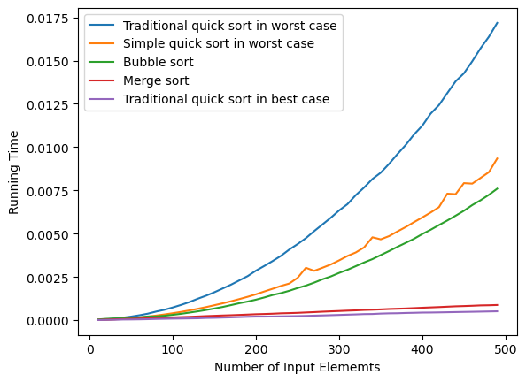
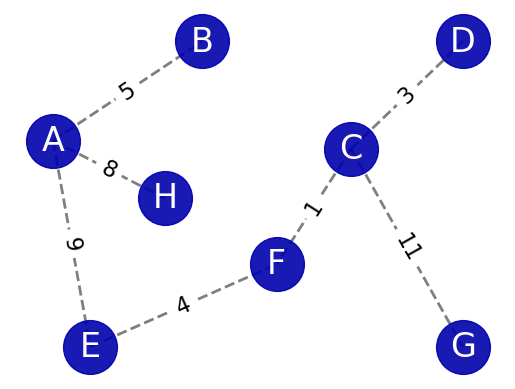

# An analysis of sorting algorithms, shortest path algorithm (Dijkstra's) and minimum spanning tree (Prim's)

This analysis has 3 main parts:

## Part 1: Implement and compare the running time of 3 sorting algorithms
- 1.1 Bubble sort
- 1.2 Quick sort
- 1.3 Merge sort

## Part 2: Implement Dijkstra's algorithm
- 2.1 Use pen and paper to run through the algorithm to find shortest path from A to G
- 2.2 Discuss the implementation and result in 2.1
- 2.3 Confirm the result in 2.1 using networkX and its Dijkstra related functions

 

## Part 3: Implement Prim's algorithm
- 3.1 Use pen and paper to run through the algorithm to find MSP
- 3.2 Discuss the implementation and result in 3.1
- 3.3 Confirm the result in 3.1 using networkX and its MSP related functions

## ☞ Main findings from the analysis

### Time complexity of Bubble sort, Quick sort & Merge sort

- With $\mathcal{O}(nlogn)$ time complexity, Merge sort and Best-case Quick sort has significantly better running times compared to the other 3 sorting algorithms of which time complexity is $\mathcal{O}(n^{2})$

- Between 2 $\mathcal{O}(nlogn)$ algorithms, **Best-case Quick sort is faster than Merge sort** during execution 
    - Reasons for this can be because Quick sort is an in-place sorting algorithm, requiring no additional storage space. Merge sort needs extra space to store subarrays during the merge process, which may lead to more cache misses and slow access. Quick sort, by operating within the array, makes better use of the cache and improves access speed.

- Among the $\mathcal{O}(n^{2})$ algorithms, **Bubble Sort has better running time than two Worst-case Quick sorts** as the size of the input array increases. This can be explained by the fact that **Quick sort is recursive, while Bubble sort is not**. In Python, each function call creates a new stack frame, which takes up memory and requires some time to set up and tear down. When a recursive function is called multiple times in Python, this can create a significant amount of overhead.

- Between 2 Worst-case Quick sorts, traditional **Quick sort which implements inplace sorting has worse running time than simple Quick sort** which returns a sorted array from the input one. This might be explained by some of the following reasons:
    - In the implementation of **traditional Quick sort** using Python, the codes **involve the calling of another function** (partition() function), which can cause a significant amount of overhead in Python. 
    - The usage of extra memory to store less, equal, and greater lists, though increases the space complexity, in some cases, might make the function execute more quickly. This is because, for smaller datasets, the **overhead of memory allocation may be minimal, while at the same time,** this implementation **avoids multiple swap operations** on the original dataset.
    

- Between **Best-case and Worst-case Quick sorts**: The **Best-case scenario has much better running time**. In Worst-cases, the pivot is chosen as the first, which means the largest element in the array on each recursive call. This results in **one partition having all the elements** and the **other partition having none of the elements**, leading to a time complexity of $\mathcal{O}(n^{2})$. In Best-case, the pivot is chosen as the middle element in the array on each recursive call. This results in **equal-sized partitions** on each recursive call, leading to a time complexity of $\mathcal{O}(nlogn)$.